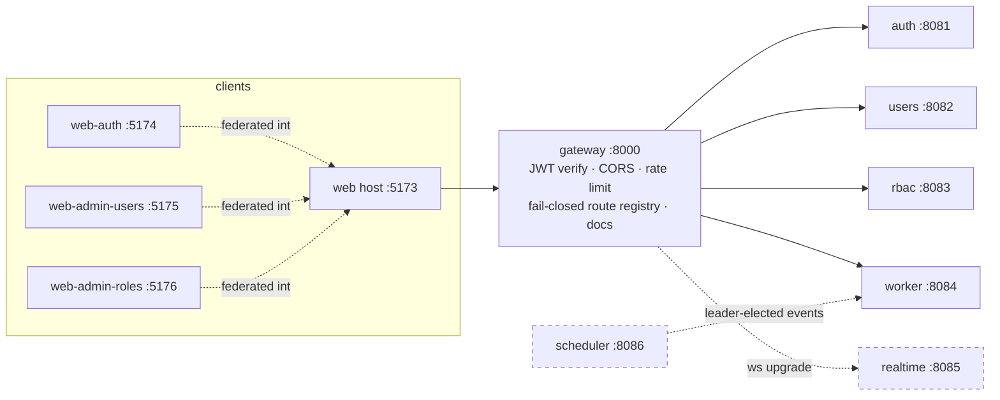
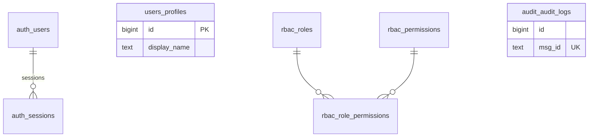
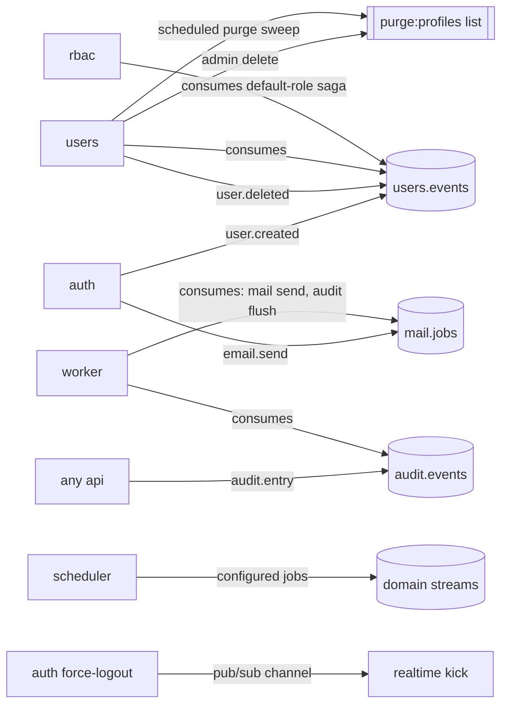
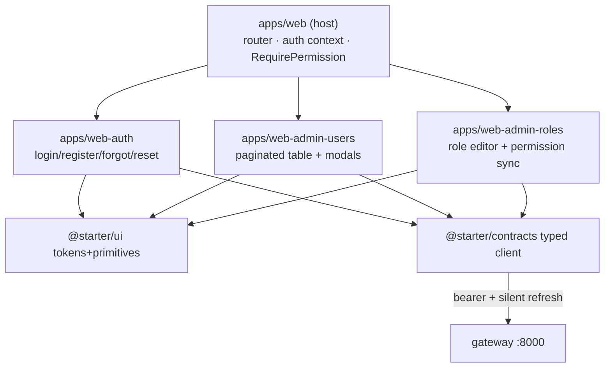
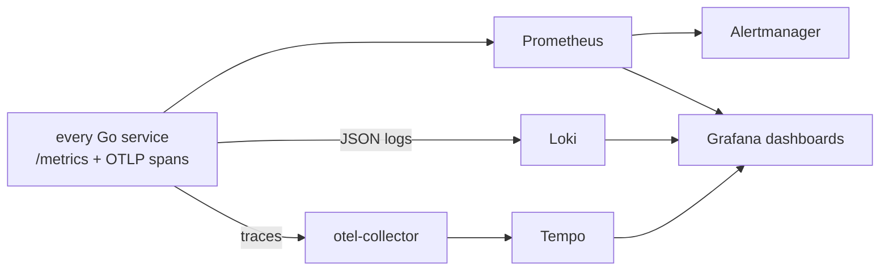

# ARCHITECTURE

Fresh-build v6 architecture: Go microservices behind a Go gateway, React
micro-frontend shell, Redis Streams as the event backbone.

## Gateway topology

- JWTs verified **once** at the edge; downstream services trust identity headers
  bound by the internal secret (`X-User-Id`, `X-Email`, `X-Internal-Secret`).
- The route registry is generated from every service's `openapi.yaml` at boot —
  a route without a spec does not exist, and an annotated permission missing
  from the compile-time catalog refuses boot (fail-closed).

## Data ownership (schema-per-service)

| Schema | Owner | Never holds |
| --- | --- | --- |
| `auth` | credentials + sessions | profile fields |
| `users` | profiles keyed by `sub` | credentials |
| `rbac` | roles / permissions / user_roles | anything else |
| `audit` | append-only trail (**worker-only writer**) | business data |

Cross-service writes are forbidden; lifecycle rides events instead.

The detailed worker/realtime, authentication, registration, token rotation,
session-state, stream-flow, and trust-boundary views live in
[DIAGRAMS.md](DIAGRAMS.md).

## Streams & topics

- Consumer groups start at stream position `0`: pre-consumer events backfill.
- Worker delivery is at-least-once with idempotent handlers and a DLQ after
  5 attempts (`<stream>:dlq`).
- Claim freshness: role edits bump affected users' `ver`; tokens carry it and
  the gateway enforces refresh on mismatch of permissions.

## Web federation

Remote URLs are runtime-configurable via `/config.js` (`window.__REMOTE_URLS__`),
so the same images serve any deployment topology.

## Observability flow

Trace IDs ride the `traceparent` header from the gateway through every hop and
appear in each service's slog lines next to the request id.
