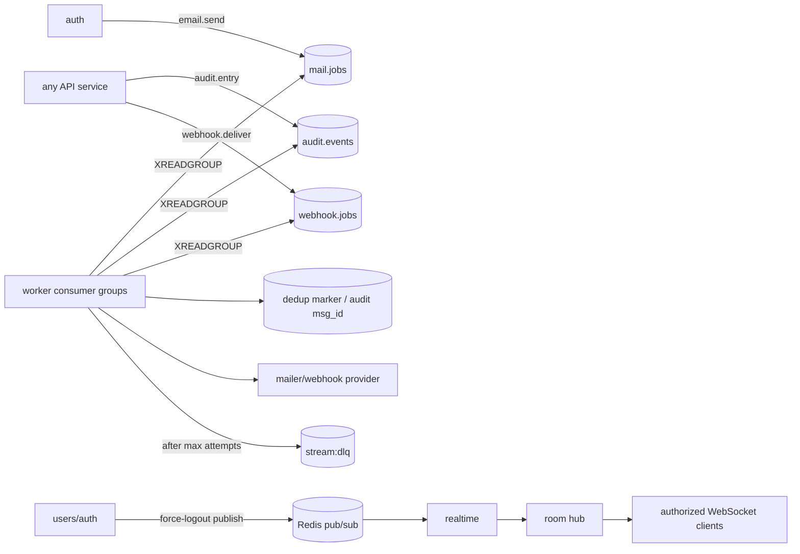
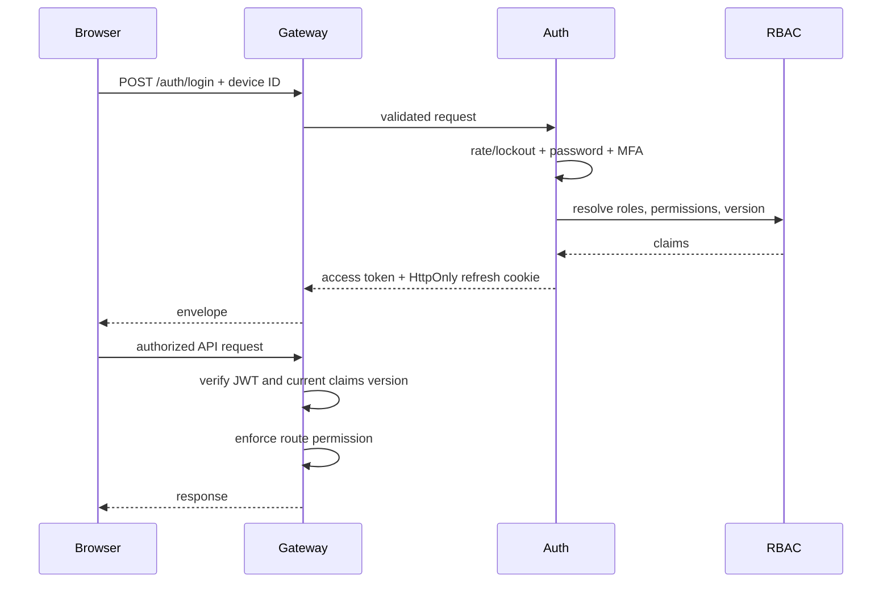
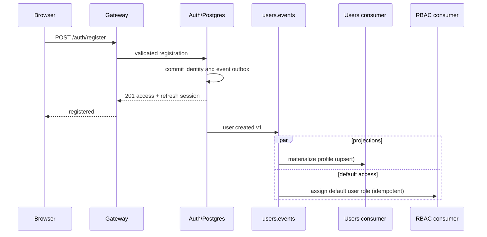
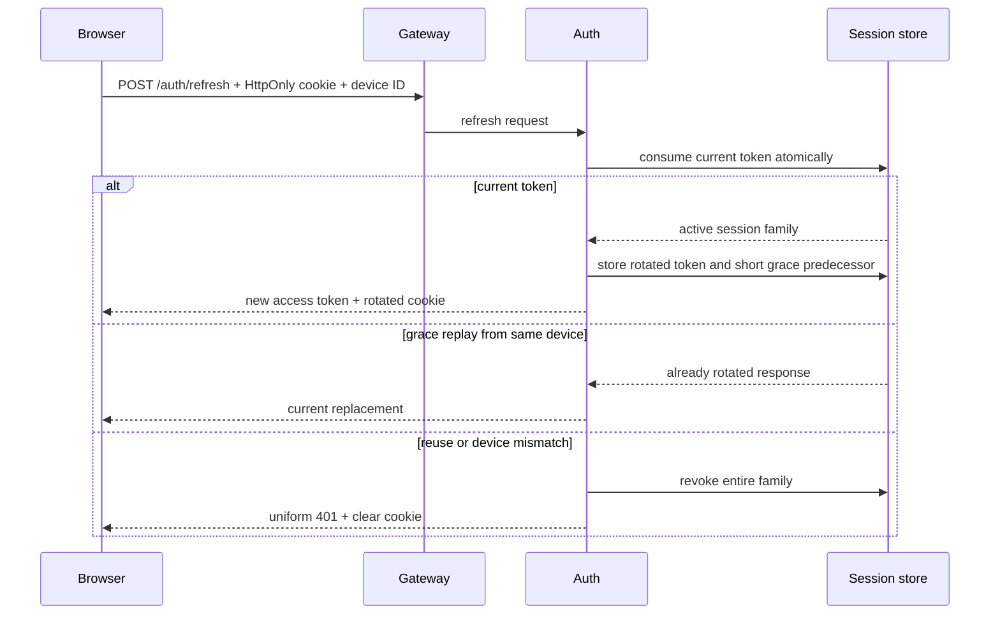
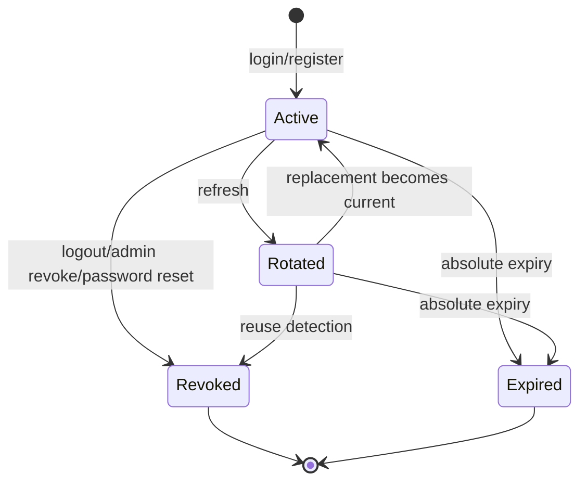
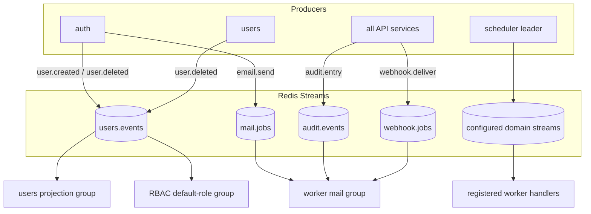
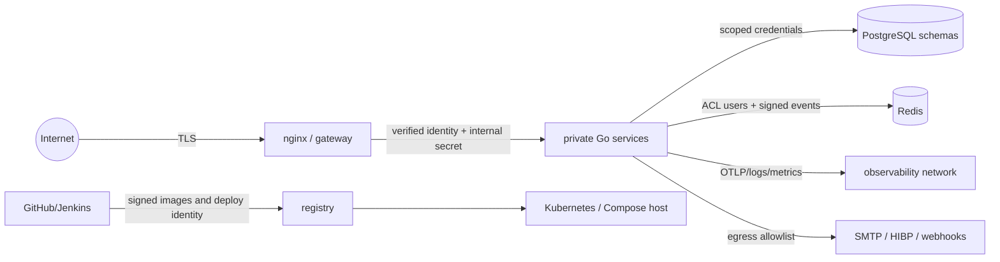

# System diagrams

These diagrams complement [the architecture overview](ARCHITECTURE.md). Names
match OpenAPI operations and Redis stream/event names.

## Worker processing and realtime delivery

Workers acknowledge only after side effects and dedup evidence succeed.
`XAUTOCLAIM` recovers abandoned messages; replay requires the offline DLQ
administrator credential. Realtime serializes writes per connection and uses
Redis only for cross-instance control messages.

## Login and authorization

## Registration and projection materialization

The response does not wait for projections. Consumers start at stream position
`0`, and stable IDs/upserts make replay safe.

## Refresh-token rotation and reuse detection

## Session lifecycle

Revoked and expired sessions never return to active. Account lock/inactivation
also makes active sessions unusable through current-state checks.

## Stream data flow

## Trust boundaries

Every arrow crosses an authentication, network, or data-ownership boundary.
Detailed threats and residual risks are in [THREAT_MODEL.md](THREAT_MODEL.md).
